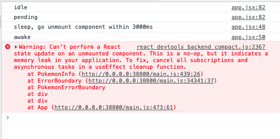

# Extra 3


## 3. 💯 make safeDispatch with useCallback, useRef, and useEffect

[Production deploy](https://advanced-react-hooks.netlify.com/isolated/final/02.extra-3.js)

**NOTICE: Things have changed slightly.** The app you're running the exercises
in was changed since the videos were recorded and you can no longer see this
issue by changing the exercise. All the exercises are now rendered in an iframe
on the exercise pages, so when you go to a different exercise, you're
effectively "closing" the page, so all JS execution for that exercise stops.

So I've added a little checkbox which you can use to mount and unmount the
component with ease. This has the benefit of also working on the isolated page
as well. On the exercise page, you'll want to make sure that your console output
is showing the output from the iframe by
[selecting the right context](https://developers.google.com/web/tools/chrome-devtools/console/reference#context).

I've also added a test for this one to help make sure you've got it right.

Also notice that while what we're doing here is still useful and you'll learn
valuable skills, the warning we're suppressing
[goes away in React v18](https://github.com/reactwg/react-18/discussions/82).

Phew, ok, back to your extra credit!

This one's a bit tricky, and I'm going to be intentionally vague here to give
you a bit of a challenge, but consider the scenario where we fetch a pokemon,
and before the request finishes, we change our mind and navigate to a different
page (or uncheck the mount checkbox). In that case, the component would get
removed from the page ("unmounted") and when the request finally does complete,
it will call `dispatch`, but because the component has been removed from the
page, we'll get this warning from React:

```text
Warning: Can't perform a React state update on an unmounted component. This is a no-op, but it indicates a memory leak in your application. To fix, cancel all subscriptions and asynchronous tasks in a useEffect cleanup function.
```

The best solution to this problem would be to
[cancel the request](https://developers.google.com/web/updates/2017/09/abortable-fetch),
but even then, we'd have to handle the error and prevent the `dispatch` from
being called for the rejected promise.

So see whether you can work out a solution for preventing `dispatch` from being
called if the component is unmounted. Depending on how you implement this, you
might need `useRef`, `useCallback`, and `useEffect`.


---


## My Note: 

Dispatching an action by an unmouted component may cause memory leaks: 


```jsx
function useAsync(initialState) {
  const [state, dispatch] = React.useReducer(
    asyncReducer,
    { status: 'idle', data: null, error: null, ...initialState }
  )

  const runAsync = React.useCallback(
    promise => {
      dispatch({type: 'pending'})
      promise.then(
        async (data) => {
          console.log('sleep, go unmount component within 3000ms')
          await sleep(3000)     // go unmount component after sleep
          console.log('awake')  // you will see this message after unmount
          dispatch({type: 'resolved', data})
        },
        error => { dispatch({type: 'rejected', error}) },
      )
    }, []
  )

  return {...state, runAsync}
}
```





