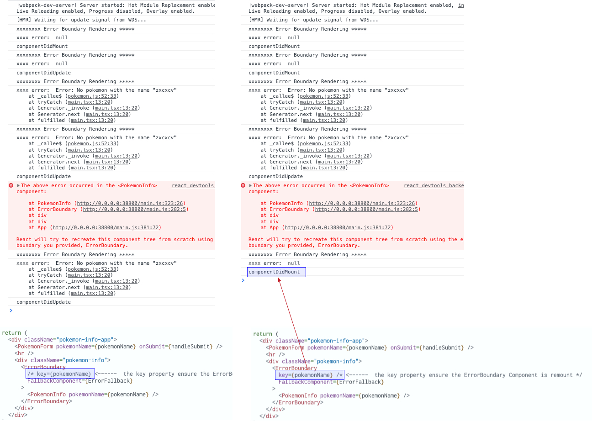

### Explaining re-mount the error boundary


The problem is `this.state.error` is not reset because the component `ErrorBoundary` never did remount.

```jsx
class ErrorBoundary extends React.Component {
  state = {error: null}
  static getDerivedStateFromError(error) {
    return {error}
  }

  componentDidUpdate() {
    console.log('componentDidUpdate')
  }

  componentDidMount() {
    console.log('componentDidMount')
  }

  render() {
    const {error} = this.state  // <---- Here is the problem, `this.state.error` is never reset
    console.log('xxxxxxxx Error Boundary Rendering *****')
    console.log('xxxx error: ', error)
    if (error) {
      return <this.props.FallbackComponent error={error} />
    }

    return this.props.children
  }
}

```
This is solved by the key property which ensure that component `ErrorBoundary` is remount when `pokemonName` change.

```jsx
function App() {
  // ...

  return (
    <div className="pokemon-info-app">
        // ...
        <ErrorBoundary
          /* key={pokemonName} <------  the key property ensure the ErrorBoundary Component is remount */
          FallbackComponent={ErrorFallback}
        >
          <PokemonInfo pokemonName={pokemonName} />
        </ErrorBoundary>
        // ...
    </div>
  )
}
```



