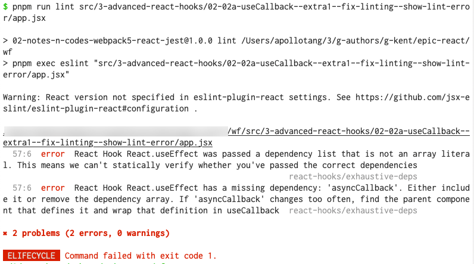

# lint error: react-hooks/exhaustive-deps

## Add configuration:

```bash
$ gdf --cached .eslintrc.js
diff --git a/.eslintrc.js b/.eslintrc.js
index 098a2a8..e3f46cd 100644
--- a/.eslintrc.js
+++ b/.eslintrc.js
@@ -17,8 +17,10 @@ module.exports = {
     },
     "plugins": [
         "react",
+        "react-hooks",
         "@typescript-eslint"
     ],
     "rules": {
+        "react-hooks/exhaustive-deps": "error",
     }
 }
```

REF:  

https://stackoverflow.com/a/59714491/3136861

https://stackoverflow.com/a/59612124/3136861


## Enable linting-next-line

```jsx
function useAsync(asyncCallback, initialState, dependencies) {
  const [state, dispatch] = React.useReducer(asyncReducer, {
    status: 'idle',
    data: null,
    error: null,
    ...initialState,
  })

  React.useEffect(() => {
    const promise = asyncCallback()
    if (!promise) {
      return
    }
    dispatch({type: 'pending'})
    promise.then(
      data => {
        dispatch({type: 'resolved', data})
      },
      error => {
        dispatch({type: 'rejected', error})
      },
    )
    // too bad the eslint plugin can't statically analyze this :-(
    // xxxxxxx eslint-disable-next-line react-hooks/exhaustive-deps
  }, dependencies)

  return state
}
```


